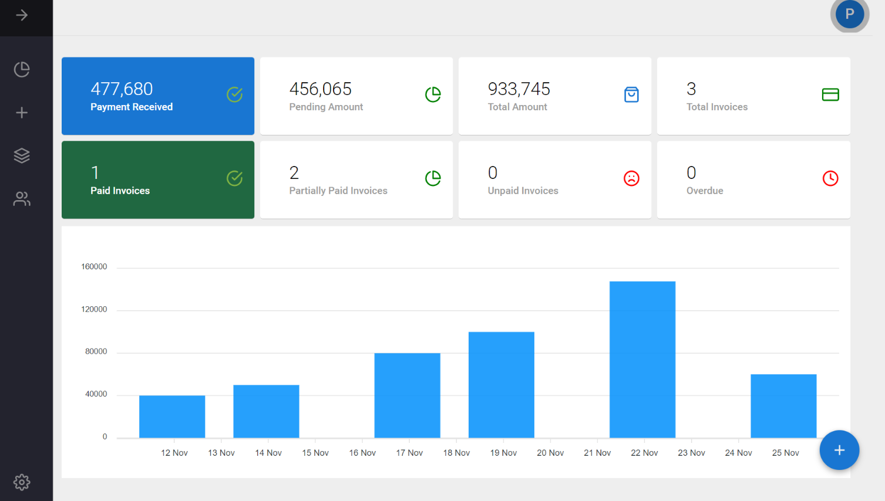

# SmartLedger

A modern, open-source MERN stack invoicing application for freelancers and small businesses.



## Table of Contents
- [Introduction](#introduction)
- [Features](#features)
- [Tech Stack](#tech-stack)
- [Getting Started](#getting-started)
- [Environment Variables](#environment-variables)
- [Docker Support](#docker-support)
- [Troubleshooting](#troubleshooting)
- [License](#license)

## Introduction
SmartLedger is a full-stack invoicing solution built with MongoDB, Express, React, and Node.js. It allows users to create, send, and manage invoices, receipts, estimates, and more. Designed for ease of use and flexibility, SmartLedger is perfect for freelancers, small businesses, and anyone needing a simple invoicing tool.

## Features
- Create and send invoices, receipts, estimates, and quotations
- Generate and email/download PDF documents
- Track payment status and history
- Partial payment support
- Dashboard with statistics and recent activity
- Multi-user registration and authentication (JWT & Google OAuth)
- Email notifications via SMTP

## Tech Stack
- **Frontend:** React, Redux, Material UI, Axios
- **Backend:** Node.js, Express, Mongoose
- **Database:** MongoDB
- **Authentication:** JWT, Google OAuth
- **PDF Generation:** html-pdf
- **Email:** Nodemailer

## Getting Started
### Prerequisites
- Node.js & npm
- MongoDB (local or Atlas)
- (Optional) Docker

### Installation
1. **Clone the repository:**
   ```bash
   git clone https://github.com/itspiyush3451/SmartLedger.git
   cd SmartLedger
   ```
2. **Install dependencies:**
   - Client:
     ```bash
     cd client
     npm install
     ```
   - Server:
     ```bash
     cd ../server
     npm install
     ```
3. **Set up environment variables:**
   - See [Environment Variables](#environment-variables) below.
4. **Start the development servers:**
   - In one terminal:
     ```bash
     cd client
     npm start
     ```
   - In another terminal:
     ```bash
     cd server
     npm start
     ```

## Environment Variables
### Client (`client/.env`):
```
REACT_APP_GOOGLE_CLIENT_ID=your_google_client_id
REACT_APP_API=http://localhost:5000
REACT_APP_URL=http://localhost:3000
```

### Server (`server/.env`):
```
DB_URL=mongodb://localhost:27017/SmartLedger
PORT=5000
SECRET=your_jwt_secret
SMTP_HOST=smtp.gmail.com
SMTP_PORT=587
SMTP_USER=your.email@gmail.com
SMTP_PASS=your_app_password
```

## Docker Support
1. Add your `.env` files to `client` and `server` as above.
2. Build and run with Docker Compose:
   ```bash
   docker-compose -f docker-compose.prod.yml build
   docker-compose -f docker-compose.prod.yml up
   ```

## Troubleshooting
- For PDF/email issues, ensure `html-pdf` and `phantomjs-prebuilt` are installed and linked:
  ```bash
  npm install html-pdf -g
  npm link html-pdf
  npm link phantomjs-prebuilt
  ```
- Check your MongoDB and SMTP credentials if you encounter connection errors.

## License
SmartLedger is open-source and available under the [MIT License](LICENSE).
